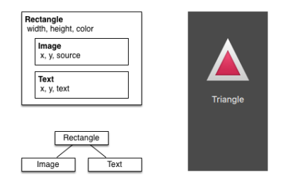

QT Quick 是基于 QML 的全新框架, 在 QT5 中首次出现，是当前流行的 QT GUI 绘制方式.
QML 可以用来控制界面元素+属性+信号+属性绑定(**简直就是 html+css+js**)，不需要 C++参与界面样式设置.

# 简单示例



上图对应的 qml 为:

```qml
//导入qt模块, 后跟版本号, 比如5.12. QT6中可不写
import QtQuick

//定义根节点, 一个长方形
Rectangle {
    //定义节点id, 用于找到节点
    id: root
    //长宽
    width: 120; height: 240
    //颜色
    color: "#4A4A4A"

    // Declare a child
    Image {
        id: triangle
        //设置绘制起点, 可通过parent访问父节点属性
        x: (parent.width - width)/2; y: 40
        source: 'assets/triangle_red.png'
    }

    // another child
    Text {
        // un-named element
        //设置绘制起点, 可通过id访问其他节点属性
        y: triangle.y + triangle.height + 20
        // reference root element
        width: root.width
        color: 'white'
        horizontalAlignment: Text.AlignHCenter
        text: 'Triangle'
    }
}
```

# QML 语法

## element

### 可见组件

| element   | 类型                                 |
| --------- | ------------------------------------ |
| Item      | 所有可见组件的基类, 通常用作容器节点 |
| Rectangle | 长方形                               |
| Text      | 文本框                               |
| Image     | 图像                                 |
| MouseArea | 可以捕获鼠标事件的矩形区域           |

可以用上面的基本组件组成更复杂的组件, 放在一个 qml 文件中(<name>.qml). 之后可以在其他 qml 文件中直接使用<name>引用该组件, 达到重用的目的.
例如下面的 button 组件:

```qml
// Button.qml
import QtQuick

Rectangle {
    id: root
    //设置别名, label.text作为button的text
    property alias text: label.text
    //自定义信号, 外部使用button时可以设置onClicked处理函数
    signal clicked

    width: 116; height: 26
    color: "lightsteelblue"
    border.color: "slategrey"

    Text {
        id: label
        anchors.centerIn: parent
        text: "Start"
    }

    MouseArea {
        anchors.fill: parent
        onClicked: {
            root.clicked() //触发根节点的clicked信号
        }
    }
}
```

### 不可见组件

## property

每个界面元素都有自己的属性, 属性有以下特性:

1. id 是特殊的属性, 用于标记元素节点, **在同一个 qml 文件中不能重复**
1. 属性使用`<name>:<value>`进行设置, 同一行设置多个属性用`;`隔开
1. 属性值可以依赖(同节点或其他节点的)其他属性, 称之为**binding**
1. 元素节点可以添加新的属性, 格式为:`property <type> <name>:<value>`
1. 属性可以设置别名, 格式为:`property alias <name>:<reference>`
1. 属性变化会产生 signal, 可通过如下格式设置信号处理函数:`onXxxChanged: js_function`
1. 有些属性属于元素本身, 被所有节点共享(类似 Cpp 类静态成员和对象成员), 可用如下格式统一设置: `<Element>.<property>:<value>`

## javascript

qml 可以使用 js, 当某些信号产生时执行界面相关的 js 函数, 类似 html 中 js 动态修改页面.

## 自定义 element

# C++代码中控制样式

所有的 QML 对象类型都是源自 QObject 类型，因此,QML 引擎可以使用 Qt 元对象系统动态的实例化 QML 对象，并获取所创建对象的属性与方法。也就是说一旦创建了 QML 对象，就可以使用 C++获取它的属性、函数与信号处理。
假设存在一个名为 MyItem.qml 的文件，内容如下

```qml
import QtQuick 2.12

Item {
    width: 100; height: 100

   Image {
        id: background
        anchors.fill: parent
        source: "login_bg.png"
    }
}
```

在 C++中，QML 文档可以使用  `QQmlComponent`或  `QQuickView`来加载。

- 使用 QQmlComponent 需要调用`QQmlComponent::create()`创建一个 QObject 实例。并在使用完后 delete。
- 使用 QQuickView 会自动的创建一个 QObject 实例，可以通过`view.rootObject()`来获取。

加载方法如下：

```cpp
// Using QQmlComponent
QQmlEngine engine;
QQmlComponent component(&engine, QUrl::fromLocalFile("MyItem.qml"));
QObject* object = component.create();
...
delete object;

// Using QQuickView
QQuickView view;
view.setSource(QUrl::fromLocalFile("MyItem.qml"));
view.show();
QObject* object = view.rootObject();

//获取QObect后，通过name获取qml对象，并设置属性
QObject* img = object->findChild<QObject*>("background");
if (img)
    img->setProperty("color", "red");
```
