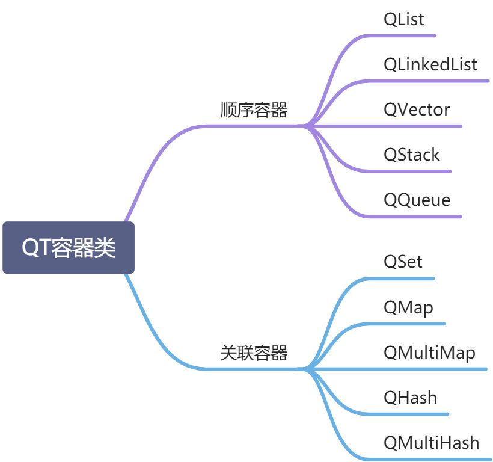

# 1 容器

QT 类库提供了容器类和 STL 中的差不多，但更加轻巧安全，QT 容器时隐式共享和可重入的，并且线程安全，可以被多个线程读取（写入不是线程安全）。**隐式共享**是对象的管理方法。一个对象被隐式共享，只是传递该对象的一个指针给使用者，而不实际复制对象数据，只有在使用者修改数据时，才实质复制共享对象给使用者。并且即当有一个迭代器在操作一个容器变量时，不要去复制这个容器变量。以此保证线程安全。

类似 STL，容器分为顺序容器和关联容器，主要有下面几种：


# 2 迭代器

对于每一个容器类，都有两个迭代器：一个用于只读访问，一个用于读写访问。无需修改数据时一定使用只读迭代器，因为它们速度更快。

## 2.1 java 风格迭代器

| 容器类                            | 只读迭代器             | 读写迭代器                    |
| --------------------------------- | ---------------------- | ----------------------------- |
| QList<T>, QQueue<T>               | QListItcrator<T>       | QMutableListItcrator<T>       |
| QLinkedList<T>                    | QLinkedListIterator<T> | QMutableLinkedListIterator<T> |
| QVector<T>, QStack<T>             | QVectorllcrator<T>     | QMutableVectorIterator<T>     |
| QSet<T>                           | QSetItcrator<T>        | QMutableSetItcrator<T>        |
| QMap<Key, T>, QMultiMap<Key, T>   | QMapIterator<Key, T>   | QMutableMapIterator<Key, T>   |
| QHash<Key, T>, QMultiHash<Key, T> | QHashIterator<Key, T>  | QMutablcHashlterator<Key, T>  |

使用示例如下：

```cpp
QList<QString> list;
list << "A" << "B" << "C" << "D";
QListIterator<QString> i (list);
while (i.hasNext())
    qDebug () << i.next ();
```

## 2.2 STL 风格迭代器

STL 迭代器与 Qt 和 STL 的原生算法兼容，并且进行了速度优化，比 java 风格的效率高：

| 容器类                           | 只读迭代器                     | 读写迭代器               |
| -------------------------------- | ------------------------------ | ------------------------ |
| QList<T>, QQueue<T>              | QList<T>::const_iterator       | QList<T>::iterator       |
| QLinkedList<T>                   | QLinkedList<T>::const_iterator | QLinkedList<T>::iterator |
| QVector<T>, QStack<T>            | QVector<T>::const_iterator     | QVector<T>::iterator     |
| QSet<T>                          | QSet<T>::const_iterator        | QSet<T>::iterator        |
| QMap<Key, P> QMultiMap<Kcy, T>   | QMap<Key, T>::const_iterator   | QMap<Key, T>::iterator   |
| QHash<Key, T> QMultiHash<Key, T> | QHash<Key, T>::const_iterator  | QHash<Key, T>::iterator  |

同样以 QList 作为示例：

```cpp
QList<QString> list;
list << "A" << "B" << "C" << "D";
QList<QString>::const_iterator i;
for (i = list.constBegin(); i != list.constEnd(); ++i)
    qDebug() << *i;
```
