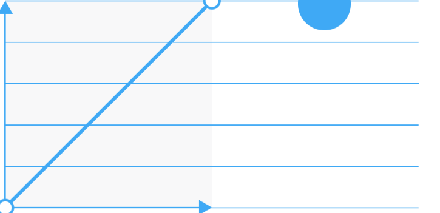
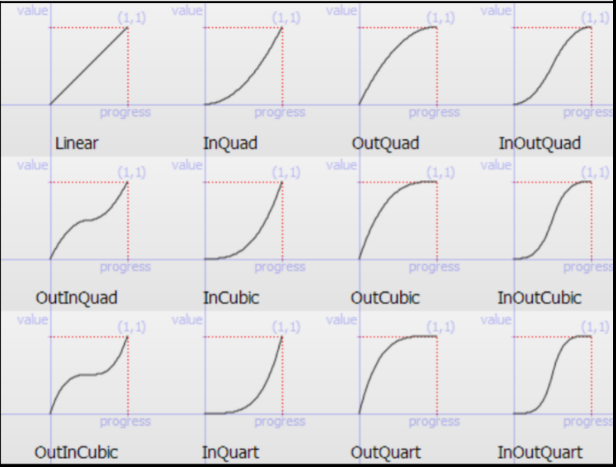
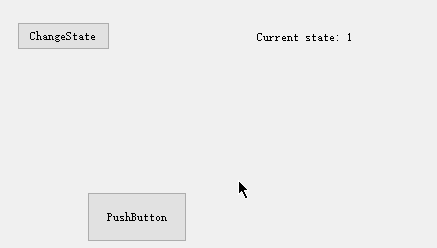

QT 中实现 GUI 动画有如下几种方式

- **Timer：**设置 timer 和 callback 函数，当 timer 超时时，利用 callback 函数修改控件的属性
- **Timeline**：类似重复的 timer，可以在每次反应槽函数被调用时传入当前重复次数，可以利用这个 index 做不同的操作
- **Animation framework**：动画框架，通过 easing curves（缓冲曲线）支持创建各种常见的动画类型
- **State machine framework**：通过信号触发每个 GUI 控件状态的变化（状态机）
- **Graphics view framework**：用于大数量的 2D 对象的显示和交互，可以用它进行 GUI 的绘制和动画设计（有点高级了）

# 1 Animation Framework

通过**QPropertyAnimation**对象设置动画属性，通过 QEasingCurve 设置缓冲曲线提供更具体的动画控制。举例如下：

```cpp
 //为button添加动画
QPropertyAnimation* animation = new QPropertyAnimation(ui->pushButton, "geometry");
animation->setDuration(3000);
animation->setStartValue(ui->pushButton->geometry());
animation->setEndValue(QRect(200, 200, 100, 50));
//添加easing curve
QEasingCurve curve;
curve.setType(QEasingCurve::OutBounce);
curve.setAmplitude(1.00);
curve.setOvershoot(1.70);
curve.setPeriod(0.30);
animation->setEasingCurve(curve);
//animation->setLoopCount(2);//设置动画循环次数
animation->start();
```

## 1.1 Easing curve

Easing Curves 其实就是一条曲线，**它定义了加速度模式**。Easing Curves 又叫时间函数、贝塞尔曲线或曲线等等。
Easing Curve 通过 X 和 Y 轴，定义**动画完成的百分比**，X 轴对应时间，Y 轴对应动画百分比，**其实就是时间和空间的概念**。Type 是曲线的不同样式（QT 支持 14 种曲线），不同的曲线代表不同的动画效果。比如下面 lineard 示例，代表动画的速度始终保持一致：





## 1.2 动画组

上面例子中我们只创建了一个 animation 对象，如果 GUI 中多个控件都需要动画，那么我们需要**QParallelAnimationGroup 或\*\***QSequentialAnimationGroup\*\*对象将所有的 animation 实例包含在一起，然后统一 start。

- QSequentialAnimationGroup：顺序执行动画，同一时间只有一个动画
- QParallelAnimationGroup：同时执行动画

```cpp
//创建动画组
QParallelAnimationGroup* group = new QParallelAnimationGroup;
group->addAnimation(animation1);
group->addAnimation(animation2);
group->start();
```

另外 animation group 也可以 add 其他的 group，实现多重嵌套。

# 2 **State machine framework**

状态机可以用于很多功能，本文档我们只关注**如果通过 QT 状态机实现动画效果。**基本需要完成三部分操作：

1. 添加状态，并设置不同状态下控件的样式
1. 添加 animation transition，让状态切换时有动画过渡，不能一下子变过去
1. 绑定事件触发状态切换

```cpp
//使用state machine实现动画
QStateMachine* machine = new QStateMachine(this);
QState* s1 = new QState();//创建一个状态
s1->assignProperty(ui->label1, "text", "Current state: 1");//此状态下控件的属性
s1->assignProperty(ui->pushButton3, "geometry", QRect(400, 200, 100, 50));

QState* s2 = new QState();
s2->assignProperty(ui->label1, "text", "Current state: 2");
s2->assignProperty(ui->pushButton3, "geometry", QRect(600, 50, 140, 100));

//绑定控件事件和状态
QEventTransition* t1 = new QEventTransition(ui->changeState, QEvent::MouseButtonPress);
//状态切换时添加动画，不能瞬间变过去
t1->addAnimation(new QPropertyAnimation(ui->pushButton3, "geometry"));
t1->setTargetState(s2);
s1->addTransition(t1);

QEventTransition* t2 = new QEventTransition(ui->changeState, QEvent::MouseButtonPress);
t2->addAnimation(new QPropertyAnimation(ui->pushButton3, "geometry"));
t2->setTargetState(s1);
s2->addTransition(t2);

//添加到state machine中
machine->addState(s1);
machine->addState(s2);
machine->setInitialState(s1);//设置默认状态
machine->start();
```

上述代码设置了两个状态，每个状态下 label1 和 pushbotton3 的部分属性是不一样的。当使用 QEventTransition 进行状态的切换时，通过 addAnimation 函数我们就可以让状态的切换动起来，变成动画，而不是呆板的瞬间变换状态。上述代码的效果如下：


