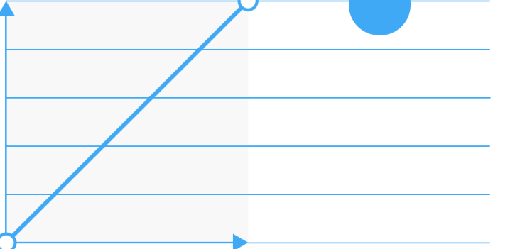
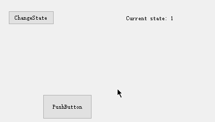

QT中实现GUI动画有如下几种方式

- **Timer：**设置timer和callback函数，当timer超时时，利用callback函数修改控件的属性
- **Timeline**：类似重复的timer，可以在每次反应槽函数被调用时传入当前重复次数，可以利用这个index做不同的操作
- **Animation framework**：动画框架，通过easing curves（缓冲曲线）支持创建各种常见的动画类型
- **State machine framework**：通过信号触发每个GUI控件状态的变化（状态机）
- **Graphics view framework**：用于大数量的2D对象的显示和交互，可以用它进行GUI的绘制和动画设计（有点高级了）

# 1 Animation Framework
通过**QPropertyAnimation**对象设置动画属性，通过QEasingCurve设置缓冲曲线提供更具体的动画控制。举例如下：
```cpp
 //为button添加动画
QPropertyAnimation* animation = new QPropertyAnimation(ui->pushButton, "geometry");
animation->setDuration(3000);
animation->setStartValue(ui->pushButton->geometry());
animation->setEndValue(QRect(200, 200, 100, 50));
//添加easing curve
QEasingCurve curve;
curve.setType(QEasingCurve::OutBounce);
curve.setAmplitude(1.00);
curve.setOvershoot(1.70);
curve.setPeriod(0.30);
animation->setEasingCurve(curve);
//animation->setLoopCount(2);//设置动画循环次数
animation->start();
```

## 1.1 Easing curve
Easing Curves其实就是一条曲线，**它定义了加速度模式**。Easing Curves又叫时间函数、贝塞尔曲线或曲线等等。
Easing Curve通过X和Y轴，定义**动画完成的百分比**，X轴对应时间，Y轴对应动画百分比，**其实就是时间和空间的概念**。Type是曲线的不同样式（QT支持14种曲线），不同的曲线代表不同的动画效果。比如下面lineard示例，代表动画的速度始终保持一致：

              

 

## 1.2 动画组
上面例子中我们只创建了一个animation对象，如果GUI中多个控件都需要动画，那么我们需要**QParallelAnimationGroup或****QSequentialAnimationGroup**对象将所有的animation实例包含在一起，然后统一start。

- QSequentialAnimationGroup：顺序执行动画，同一时间只有一个动画
- QParallelAnimationGroup：同时执行动画
```cpp
//创建动画组
QParallelAnimationGroup* group = new QParallelAnimationGroup;
group->addAnimation(animation1);
group->addAnimation(animation2);
group->start();
```
另外animation group也可以add其他的group，实现多重嵌套。

# 2 **State machine framework**
状态机可以用于很多功能，本文档我们只关注**如果通过QT状态机实现动画效果。**基本需要完成三部分操作：

1. 添加状态，并设置不同状态下控件的样式
1. 添加animation transition，让状态切换时有动画过渡，不能一下子变过去
1. 绑定事件触发状态切换
```cpp
//使用state machine实现动画
QStateMachine* machine = new QStateMachine(this);
QState* s1 = new QState();//创建一个状态
s1->assignProperty(ui->label1, "text", "Current state: 1");//此状态下控件的属性
s1->assignProperty(ui->pushButton3, "geometry", QRect(400, 200, 100, 50));

QState* s2 = new QState();
s2->assignProperty(ui->label1, "text", "Current state: 2");
s2->assignProperty(ui->pushButton3, "geometry", QRect(600, 50, 140, 100));

//绑定控件事件和状态
QEventTransition* t1 = new QEventTransition(ui->changeState, QEvent::MouseButtonPress);
//状态切换时添加动画，不能瞬间变过去
t1->addAnimation(new QPropertyAnimation(ui->pushButton3, "geometry"));
t1->setTargetState(s2);
s1->addTransition(t1);

QEventTransition* t2 = new QEventTransition(ui->changeState, QEvent::MouseButtonPress);
t2->addAnimation(new QPropertyAnimation(ui->pushButton3, "geometry"));
t2->setTargetState(s1);
s2->addTransition(t2);

//添加到state machine中
machine->addState(s1);
machine->addState(s2);
machine->setInitialState(s1);//设置默认状态
machine->start();
```
上述代码设置了两个状态，每个状态下label1和pushbotton3的部分属性是不一样的。当使用QEventTransition进行状态的切换时，通过addAnimation函数我们就可以让状态的切换动起来，变成动画，而不是呆板的瞬间变换状态。上述代码的效果如下：


