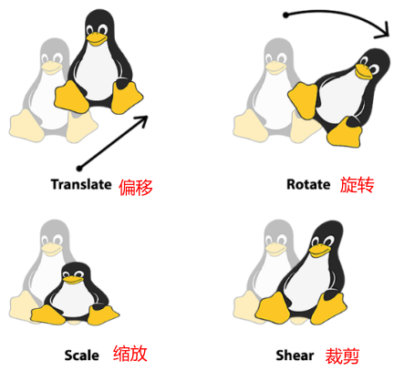
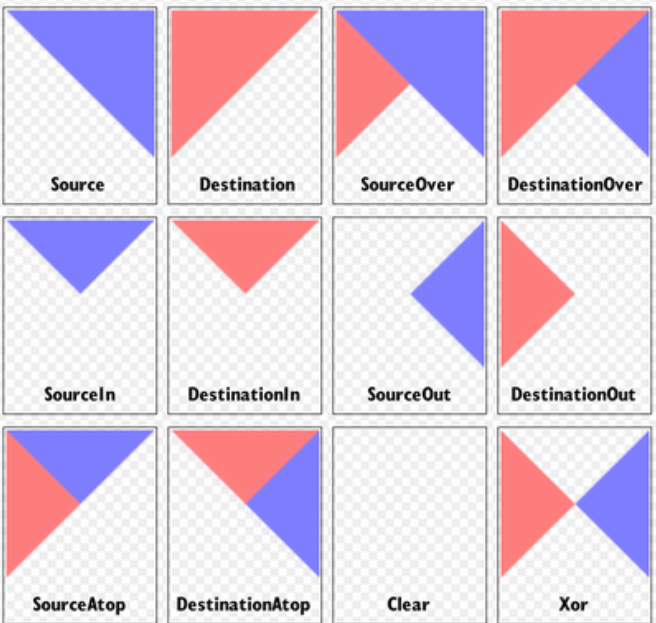
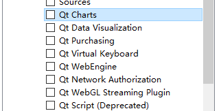

# 1 QPainter C++ API

通过 QPainter 可以在 GUI 上渲染矢量图形、文本、2D 图像，甚至是 3D 图像。使用 QPainter 可以方便自由的绘制想要的图形，也可以用 QPainter 创建自己的控件。QPainter 只能在 QObject 对象的**paintEvent()函数**中绘制图形。

## 1.1 Qpainter 常用属性和方法

QPainter 类的成员角色有，我们可以注入这些对象来改变 QPainter 的一些默认属性:

- QPen         : 用于绘制几何图形的边缘,由颜色,宽度,线风格等参数组成
- QBrush     : 用于填充几何图形的调色板,由颜色和填充风格组成
- QFont       : 用于文本绘制
- QPixmap  : 绘制图片,可以加速显示,带有屏幕截图,窗口截图等支持,适合小图片
- QImage    : 绘制图片,可以直接读取图像文件进行像素访问,适合大图片
- QBitmap  : QPixmap 的一个子类，主要用于显示单色位图
- QPicture  : 绘图装置，用于记录和重播 Qpainter 的绘图指令

QPainter 的主要图形绘制函数有：

| **成员函数** | **功能** | **成员函数**      | **功能**     |
| ------------ | -------- | ----------------- | ------------ |
| drawPoint    | 绘制点   | drawChord         | 绘制弦       |
| drawLine     | 绘制直线 | drawPolygon       | 绘制多边形   |
| drawRect     | 绘制矩形 | drawRoundedRect   | 绘制圆角矩形 |
| drawArc      | 绘制圆弧 | drawPolyline      | 绘制折线     |
| drawEllipse  | 绘制椭圆 | drawConvexPolygon | 绘制凸多边形 |
| drawPie      | 绘制扇形 | drawImage         | 绘制图片     |

使用示例：

```cpp
//用Qpainter绘制界面，不使用控件
QPainter textPainter;
textPainter.begin(this);
textPainter.setFont(QFont("times", 14, QFont::Bold));
textPainter.drawText(QPoint(20, 30), "Testing");//绘制文字
textPainter.end();

QPainterPath rectPath;
rectPath.addRect(QRect(150, 20, 100, 50));
QPainter pathPainter;
pathPainter.begin(this);
//设置pen的属性
pathPainter.setPen(QPen(Qt::red, 1, Qt::DashDotLine,
                        Qt::FlatCap, Qt::MiterJoin));
pathPainter.setBrush(Qt::yellow);
pathPainter.drawPath(rectPath);
pathPainter.end();

//绘制图片
QImage image;
image.load(":/tux.png");
QPainter imagePainter(this);
imagePainter.begin(this);
imagePainter.drawImage(QPoint(100, 150), image);
imagePainter.end();
```

## 1.2 导出图形为 SVG 文件

SVG 是一种图像文件格式，它的英文全称为 Scalable Vector Graphics，是一种用 XML 定义的语言，用来描述**二维矢量及矢量/栅格图形**。可以任意放大图形显示，但绝不会以牺牲图像质量为代价；可在 SVG 图像中保留可编辑和可搜寻的状态。QT 支持将矢量图形保存为 SVG 文件，比如 Adobe PS 中保持图片为 SVG 功能。

```cpp
//打开文件选择框
QString filePath = QFileDialog::getSaveFileName(this, "Save SVG", "SVG files (*,svg)");
if (filePath == "")
{
    return;
}
//创建QSvgGenerator
QSvgGenerator generator;
generator.setFileName(filePath);//设置文件路径
generator.setSize(QSize(this->width(), this->height()));//设置大小
generator.setViewBox(QRect(0, 0, this->width(), this->height()));
generator.setTitle(("SVG example"));
generator.setDescription("This SVG file is generated by QT");

QPainter painter;
painter.begin(&generator);//绑定painter和SVG generator
//...具体的绘制步骤
painter.end();
```

在 QPainter 创建的时候，绑定创建 QSvgGenerator，就可以在绘制结束后生成 SVG 文件。

## 1.3 坐标变换函数

Qpainter 支持坐标的变换（coordinate transformation），包含如下四种类型



- QPainter::**translate**(): Offsets the graphic's position by a given set of units
- QPainter::**rotate**(): Rotates the graphics around the origin in a clockwisedirection
- QPainter::**scale**(): Offsets the graphic's size by a given factor
- QPainter::**shear**(): Twists the graphic's coordinate system around the origin

## 1.4 设置多图片组合样式

QPaint 在绘制图片时，可以同时设置组合样式，函数：**setCompositionMode**。常见样式如下：



# 2 QCharts 图表

Qt Charts 很方便的绘制我们常见的曲线图、折线图、柱状图和饼状图等图表。不过该模块和其他一些高级模块不在 core 中，在安装时需要单独安装。图示如下：



```
QT       += core gui charts
```

正在代码中使用是，也需要注意命名空间：`using namespace QtCharts;`​
